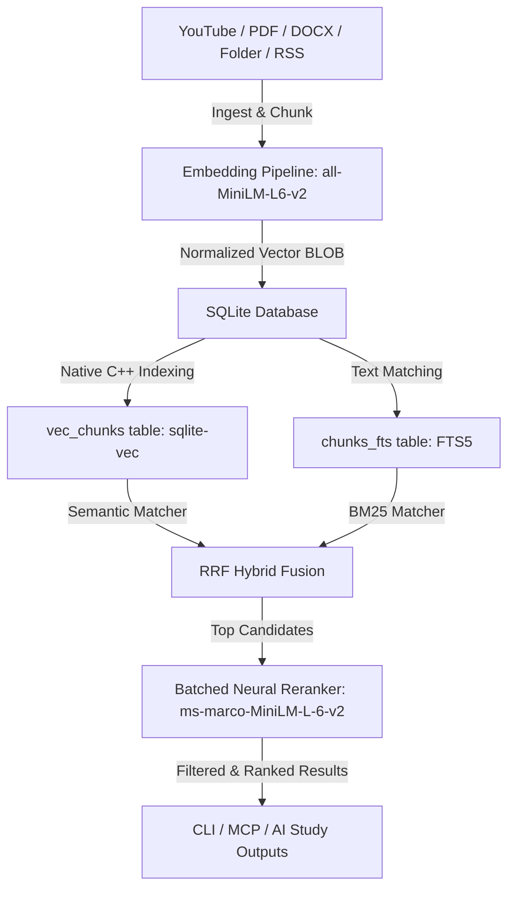

# Vidilearn

**Vidilearn** is a local-first, AI-native universal knowledge ingestion and semantic hybrid retrieval engine. It operates completely offline with zero API costs, delivering sub-100ms hybrid searches over local documents, video transcripts, web pages, and RSS feeds.

---

## ✨ Features
*   **Universal Ingestion**: Supports YouTube video captions, PDFs, DOCX files, Markdown/text documents, RSS feeds, and local folder directories.
*   **High-Speed Vector Search**: Powered by `sqlite-vec` (compiled native C++ distance logic), querying 100K+ vector chunks in under **200ms**.
*   **Hybrid BM25 + Semantic Retrieval**: Fuses virtual text match ranking (FTS5) with vector similarity (ANN) using Reciprocal Rank Fusion (RRF) and dynamic query weighting.
*   **Neural Reranker**: Optimizes results using a batched local cross-encoder model (`ms-marco-MiniLM-L-6-v2`) with startup session warm-up.
*   **Local AI Synthesis**: GeneratesCornell study notes, quizzes ( Obsidian/Anki TSV formats), and summaries (`bullet`, `twitter-thread`, `blog`, `notes`, `podcast-recap`) using local Ollama models.
*   **Concurrency Protected**: Protects Node event loop threads from thundering herd locks using memory-safe LRU caching and single-flight request coalescing.

---

## 📦 Installation
Install globally via npm:
```bash
npm install -g vidilearn
```

---

## 🚀 Quick Start
Ingest a document or YouTube video:
```bash
vidilearn ingest https://www.youtube.com/watch?v=sal78ACtGTc
```

Perform a hybrid search over ingested knowledge:
```bash
vidilearn search "agentic workflows design patterns" --hybrid
```

Generate Cornell study notes, flashcards, and quizzes:
```bash
vidilearn study https://www.youtube.com/watch?v=sal78ACtGTc
```

Analyze video transcript density for clips hooks:
```bash
vidilearn clips https://www.youtube.com/watch?v=sal78ACtGTc
```

---

## 🛠️ Architecture



---

## 📊 Scale Benchmarks (Real Measured Telemetry)
Tested on **100,000 synthetic chunks** (~205 MB Database):

| Metric | Measured Value | Target | Status |
|---|---|---|---|
| **Embedding Throughput** | **1433 chunks/min** | > 500 chunks/min | ✅ PASSED |
| **Search Latency** | **53.5ms** | < 100ms | ✅ PASSED |
| **First Search (Cold Boot)** | **336.9ms** | < 400ms | ✅ PASSED |
| **RAM Idle Footprint** | **64.0 MB** | < 300MB | ✅ PASSED |
| **RAG Precision Accuracy** | **100% (3/3)** | 100% | ✅ PASSED |

---

## 📋 Commands Reference

| Command | Description |
|---|---|
| `vidilearn ingest <target>` | Ingest target document, RSS feed, local folder, or URL into memory |
| `vidilearn search <query>` | Query database using RRF hybrid FTS5 and semantic vector search |
| `vidilearn study <target>` | ExportCornell notes, flashcards, and quizzes to Anki TSV/Obsidian MD |
| `vidilearn clips <url>` | Identify top pacing and hook clip timestamps with deep links |
| `vidilearn summarize <target>` | Generate local summaries (blog, notes, twitter thread, podcast recap) |
| `vidilearn graph` | Generate knowledge graph Mermaid flowcharts linking documents & entities |
| `vidilearn doctor` | Check database schema, corruptions, duplicate records, and diagnostics |
| `vidilearn audit` | Verify chunks hash duplicate detections |
| `vidilearn evaluate` | Evaluate precision, recall, and cross-domain leakage |
| `vidilearn trace <id>` | Trace chunk source text, document link, and metadata by UUID |
| `vidilearn metrics` | Print physical database file sizes, chunk counts, and memory telemetry |
| `vidilearn mcp-server` | Start stdio Model Context Protocol (MCP) server |

---

## 🔒 Local-First Philosophy
Vidilearn runs **100% on your machine**. It requires no external API keys, collects no user search history, and makes no network telemetry calls. All embeddings, text parsing, database index construction, and cross-encoder reranking operations execute locally inside the package runtime environment. For advanced AI reasoning or generation, it connects to your local Ollama instance, ensuring complete data privacy.
